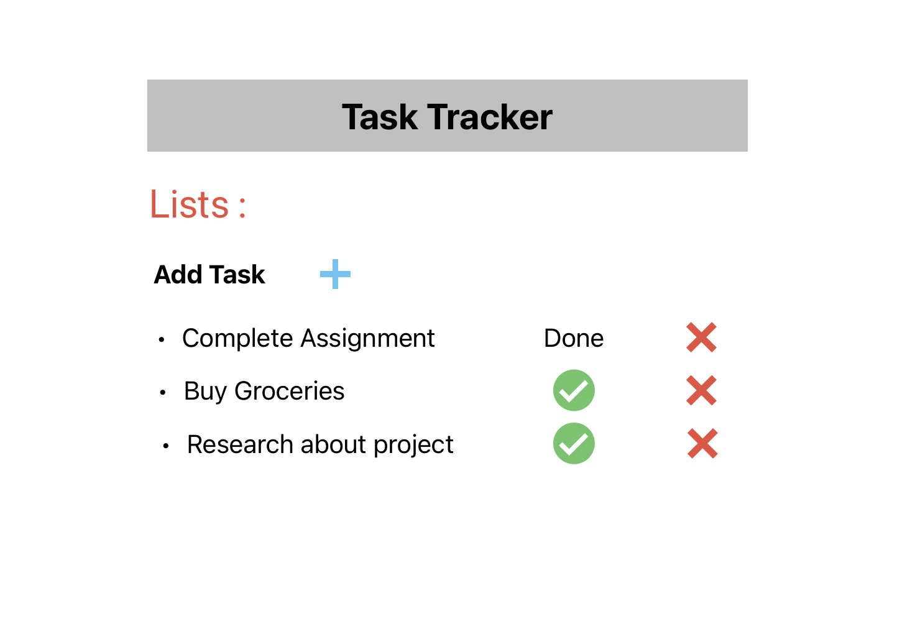
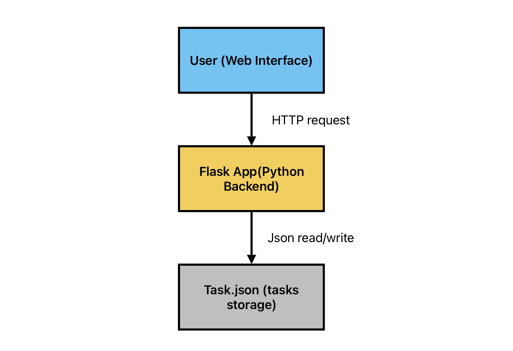

## Executive Problem Statement:
I often foreget my academic tasks or personal works that need to finish on time. So, for this project I thought of implementing a fast and simple way to track them. Most of the to-do apps that I can download are often loaded with many features which is quite complex for me. I decided to build a simple and easy to use task tracker as a web application.
## Solution Overview:
I am building a web application using Flask that lets users create/add, complete, and delete task through the interface. The tasks that are created are saved as JSON files. This will improve the usability for anyuser that wishes to use this web app.
## Key User Stories:
1. As a user, I want to build a web interface so that I can track to-dos easily.
2. As a user, I want to see all the tasks in an oragnised way so that I can see all tasks clearly.
3. As a user, I want to add  tasks to my task-tracker.
4. As a user, I want to mark my tasks as complete with a button when they are done.
5. As a user, I want to save my tasks so that i don't lose the track of them.
6. AS a user, I want to delete the old tasks that are done, so that I can keep my list clean.
## Functional and Non-Functional Requirements:
### Functional requirements
. The system should allow the user to add a task with a name.

. The system should allow the user to list all the task along with their status.

. The system should allow the user to mark the finished tasks as completed.

. The system should allow the user to delete a task.

. The system should save all tasks and load them from the saved file.
### Non-Functional requirements
. The user-interface should be easy to use and must have a fast response time.

. This application doesn't require any login or authentication from the user.

## Conceptual Wireframes or Mockups:

## High-Level Architecture Diagram:

## Tech Stack

- **Backend:** Python with Flask — lightweight and easy to build.  
- **Storage:** JSON files — simple persistent storage without a database.  
- **Frontend:** HTML, CSS, and vanilla JavaScript — minimal and fast for UI and theme toggling.  
- **Testing:** Pytest — for automated testing of task management logic.  

## Justification

This stack keeps the app simple, fast, and easy to maintain. Flask and JSON storage avoid unnecessary complexity. Pytest helps maintain code quality through testing.

## Steps to run the application:
### For web app:

python app.py

### For testing:

pip install pytest

pytest test_taskmanager.py 
